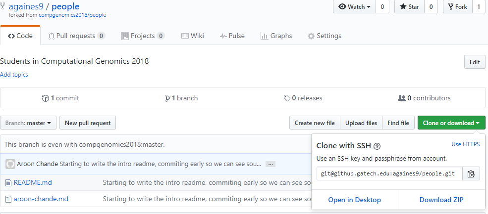
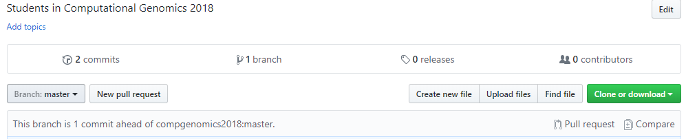
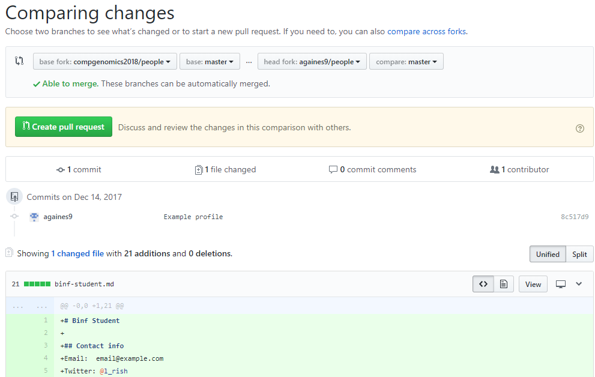

# Welcome to Computational Genomics 2018!

This year in addition to the usual public wiki, we're going to enforce the usage
of git.  We are going to use git (via the commandline and via GaTech's internal
Github website) to track the work that each group is doing.  In past years,
groups have chosen to use Github to store analysis scripts, data files and
deliverables for class.

Git is a Source Code Management (scm) software, it is designed to help you keep
track of changes made to files.  SCM software is widely used in industry and
within government labs.  If you've ever used Dropbox, Google Drive, or similar,
than you've used a form of scm -- Dropbox keeps past versions of synced files
available so that you can restore them.  Git works be checking files into ("`git
add <file>`", committing a file to history) a repository (repo for short).
Usually, you work on a local copy of the repo, and then merge your work into a
shared "master" copy of the files.  These additions and merges, or commits, form
a tree of changes.  For more complicated projects, this allows us to audit code
changes, track down people to yell at (`git blame`), and restore previous
version.  Git is a powerful tool, it does try to stop you from breaking
things... but, it doesn't try that hard.  So be careful and read warning and
error messages closely.

## Your assignment

### First things first
0.  Read the [Getting Started Tutorial]( https://git-scm.com/book/en/v2/Getting-Started-Git-Basics), maybe use the [interactive tutorial](https://try.github.io/) 
1.  Log into your GaTech Github account (https://github.gatech.edu) 
2.  Visit the people repo under the compgenomics2018 group: https://github.gatech.edu/compgenomics2018 
3.  Click the Fork button in the upper right 

### Homework

1.  SSH into the CompGenomics server  
    *host*: (This server doesn't exist yet) compgenome2018.biology.gatech.edu  
    *port*: 22  
    *username*: Your gatech username, i.e. achande3  
	*password*: Your gatech password  
	*Note*: You will need to connect to the GaTech VPN in order to log in  
2.  Generate a public/private key   
```bash  
mkdir -p ~/.ssh   
ssh-keygen -f ~/.ssh/github  
<Follow the prompts, password is optional but suggested>  
cat ~/.ssh/github.pub
ssh-rsa AAAAB3NzaC1yc2EAAAABIwAAAQEAmooN/dvBVe29fqWCYw7LXFqjNzmVaBWGXf2H936JC3QgQ2XLYMFDQCQ/z62S0yVFTUjZGyDGFESfdeJI5BddKLOLEvrEsIQBOnpA4zaNAY6ET3Sc/XzaaG3up4wvsR7cibaJQLjTn3L3w+lN4SyVXp23kl80Rrzr6jsHAYeCscSI1WNSqxmqH3z6YmOMHSNqAMgT5A2zzVTVC6Yl7XV1w8wUjzogPklnLU/q3wJnJxCBV136+VaUft5rMYMuEsp62OK2CbpZYuAXmqdkiG0Q7x9irrjBcg2uqGBHCDvqN5T6o22Xp00A6aPmT+xE5RPpurWGu0RWaJN3BkCuq7QxlQ== achande3@compgenome2018 
```   
3.  Add this public key to your github account:
https://github.gatech.edu/settings/keys   
4.  Add the below to `~/.ssh/config`   
```
host github.gatech.edu
    IdentityFile ~/.ssh/github
```  

Make sure to chmod 600 on `~/.ssh/config`  

5.  Clone the repo you forked above using SSH   
---  
    
---  
6.  Write a brief bio about
yourself using your favorite editor.  Be sure to use formatting! [Formatting
guide](https://guides.github.com/features/mastering-markdown/)   
7.  Add your files and commit your changes.   
8.  From the website, create a pull request  
---  
  

--- 

 

9.  Once you've done that, I'll accept your changes and add you to the Comp
 Genomics 2018 organization and to the groups you'll be working in
