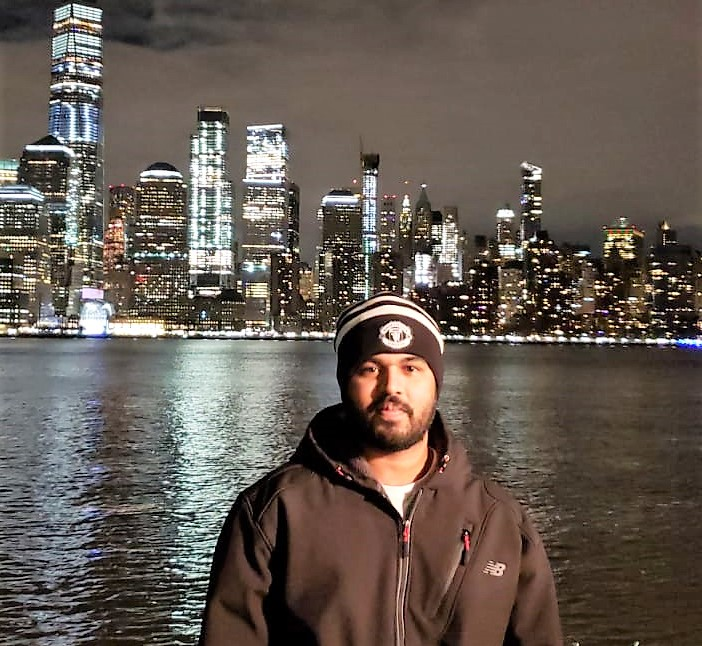

# Sachin Sarath Y Kothandaraman

## Info
email: ssyk3@gatech.edu
LinkedIn: https://www.linkedin.com/in/sachin-sarath-y-kothandaraman

## About Me
I am a MS Bioinformatics student with the [Vannberg lab](http://vannberg.biology.gatech.edu:8080/VannbergLab/home.html)

My research involves developing automated pipelines using machine learning algorithms for analysis of patient cancer data. Before joining Georgia Tech I worked as a Senior Clinical Analyst, developing workflows in electronic lab notebooks for drug development in clinical and pre-clinical stages for Bio-Pharma companies.
I am interested in the development and application of tools and novel analysis techniques to draw insights on disease diagnosis and treatment.

I am an ardent fan of the Manchester United Football Club...GGMU!!

