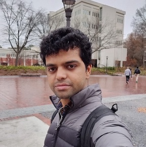

# Sreenivasan AC

## Contact info
Email:  sreenivasan.ac@gatech.edu
Phone: 404-663-9270
LinkedIn: [https://www.linkedin.com/in/sreenivasan-ac/](https://www.linkedin.com/in/sreenivasan-ac/)

## About me

I'm Sreenivas

I am a  Masters student in Computer Science, specializing in Machine Learning. 
I worked as a full stack developer in Groupon, Palo Alto, California for 2 years, and worked as a AI application developer in [Invento Robotics](http://mitrarobot.com), Bangalore which makes Humanoid robots.
I'd be graduating this semester, and be joining Google, Mountain View or Salesforce, San Francisco this June 2019.

After taking a lot of AI courses at Tech, being the last semester I wanted to try a new course from a different field. I'm interested in learning how we are currenty use computational algorithms / Deep Learning in Biology , and jump in this field if I feel there are open areas for disruption in the future. I hope taking this course would also help me diversify my areas of speciality, and I maybe able to apply to Bio-informatics companies, in tech roles.
My long term aim is to start a AI / product company in Healthcare / agriculture / education  in India.

This semester apart from this course, I'm TA-ing for Deep Learning, and pursuing a research problem related to self driving under Prof Zsolt Kira.
I'm also become a member of [Rambling Rocket club](http://rocket.gtorg.gatech.edu) hoping to launch L1, L2 rockets from a farm in Georgia this semester.

My hobbies are reading Quora, working out, travelling, writing diary journal, reading Product Hunt and blogs.

My motto is to try new things, get out of comfort zone, and live life to the fullest, and try to create value and impact on the way.

You can connect with me here:

Instagram: [https://www.instagram.com/ac_sreenivasan/](https://www.instagram.com/ac_sreenivasan/)

Facebook: [https://facebook.com/acsrini](https://facebook.com/acsrini)

LinkedIn: [https://www.linkedin.com/in/sreenivasan-ac/](https://www.linkedin.com/in/sreenivasan-ac/)
